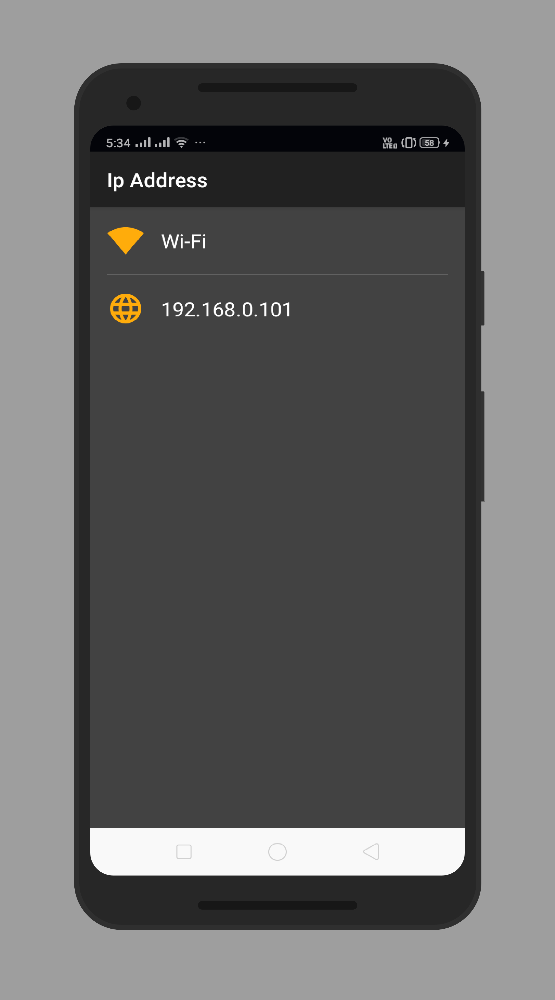
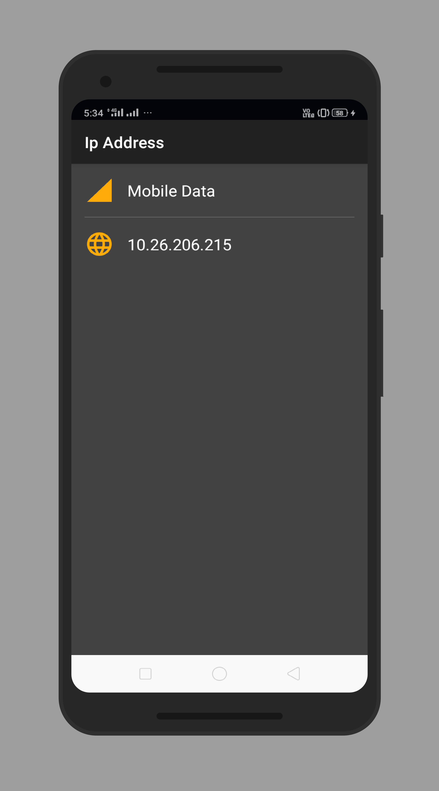
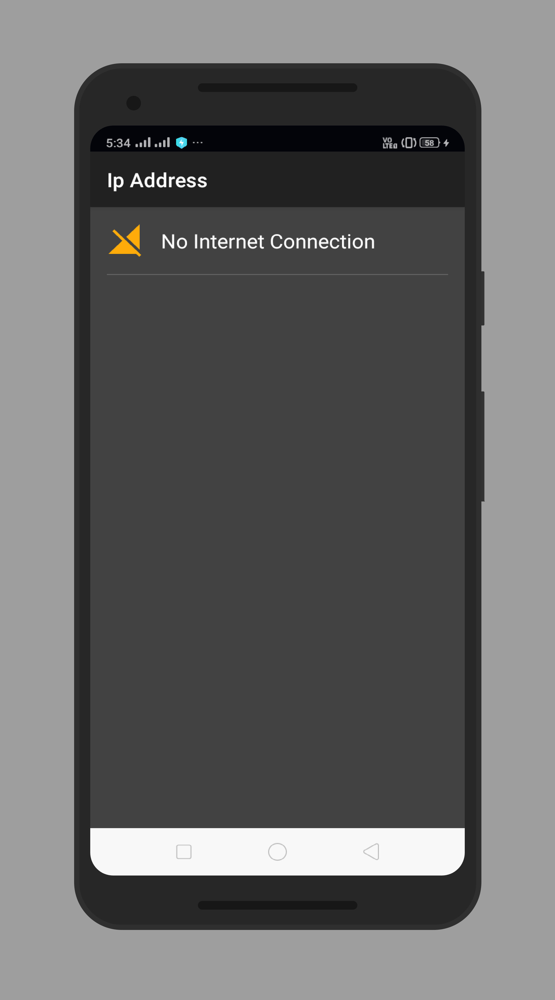

# IpAddress
There was always been a headache to doing Application testing while keeping the phone connected with a Laptop/PC with a cable. Later I found a way to debug the app on the device through Wifi using terminal, but there was a glitch! I always have to check my IP address in Mobile Settings -> About Phone -> All Specs...! and so on. I've created this app to get the IpAddress of the device on just one click. This app also displays that the device is connected to WiFi or Mobile data. 

## Tech Specs
- <b>Language</b>: Java
- <b>MinSdkVersion</b>: 17
- <b>TargetSdkVersion</b>: 29
- <b>Development Tool</b>: Android Studio

## Screenshots

